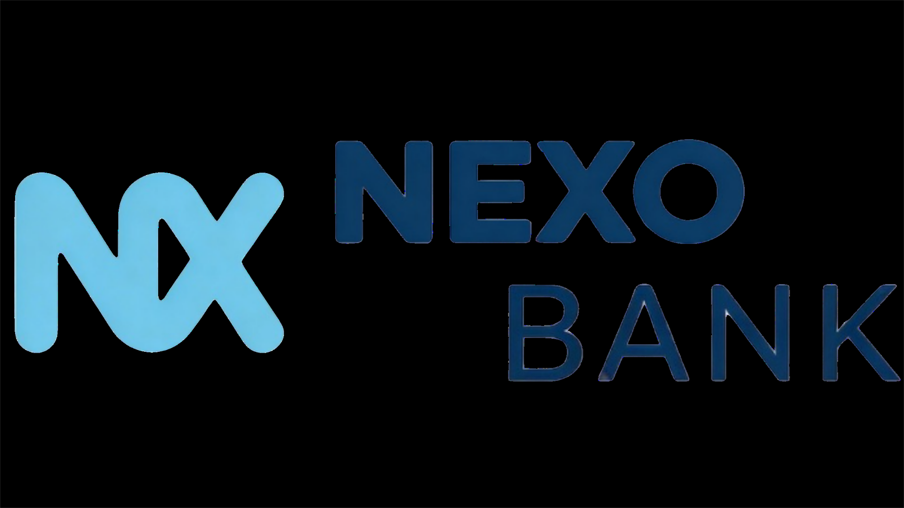
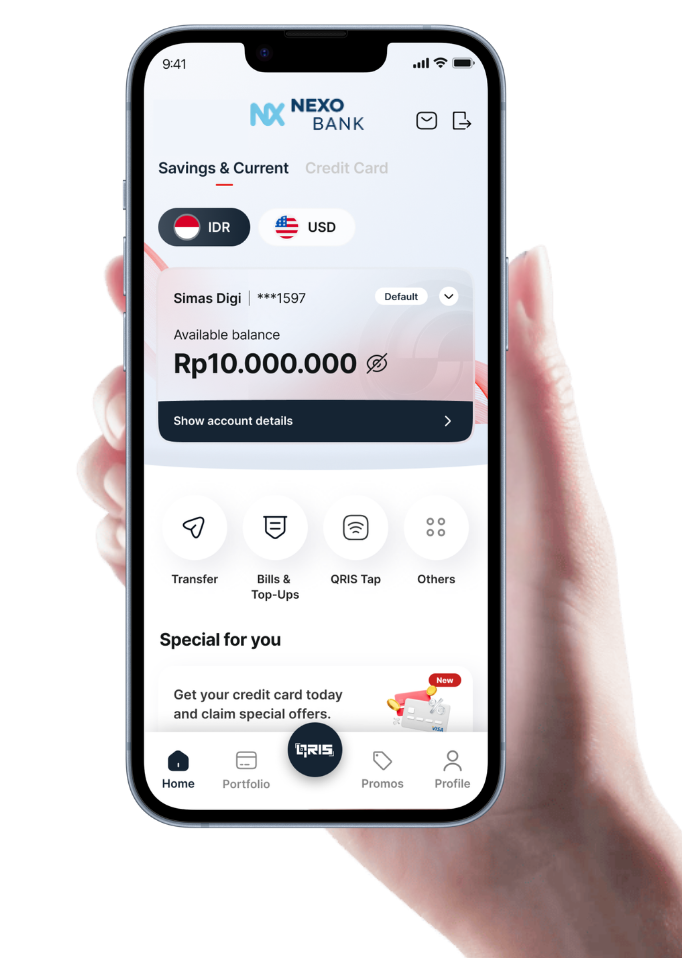

#  
# NexoBank - Your Gateway to Modern Digital Finance



Welcome to the official landing page of **Nexo Bank**. This project is the digital storefront and gateway for a comprehensive banking ecosystem designed to make financial management as seamless and intuitive as a conversation.

---

## 🌟 The Vision: Banking Reimagined

In a world that moves faster than ever, your bank should be more than just a place to store money and it should be an empowering partner. **Nexo Bank** was born from a simple idea: *Financial freedom shouldn't be complicated.*

Whether you're sending a gift to a friend across the country, splitting a dinner bill, or setting aside savings for your next big adventure, NexoBank provides a secure, fast, and transparent platform to do it all. We bridge the gap between traditional reliability and modern digital speed.

---

## ✨ Experience NexoBank

The NexoBank ecosystem (integrated via our core system) offers a suite of features designed for the modern user:

- **Seamless Wallet Management:** Track your balance in real-time with a system built for absolute precision.
- **Instant P2P Transfers:** Send funds to other NexoBank users instantly, anytime, anywhere.
- **Secure Savings Vault:** A dedicated space to protect your future goals from your daily spending.
- **Effortless Split Bills:** Coordinate shared expenses with friends without the awkward math.
- **Universal Top-Ups:** Power up your account through integrated and secure payment gateways.
- **State-of-the-Art Security:** Every transaction is guarded by multi-layer authentication and transaction-level security.

---

## 🚀 Tech Stack

The landing page is built using high-performance modern web technologies to ensure a fast, responsive, and stunning user experience:

- **Frontend:** Next.js 15+ & React 19
- **Styling:** Vanilla CSS & Tailwind CSS for precision design
- **Animations:** AOS (Animate on Scroll) & Framer Motion
- **Icons:** Phosphor Icons & Lucide React
- **Integration:** Secure cross-domain authentication with the NexoBank Core System.

---

## 🛠️ Installation & Setup (Landing Page)

To run the landing page locally on your machine, follow these steps:

1. **Clone the Repository**
   ```bash
   git clone https://github.com/egisatriaa/Nexo_Bank_Landing_Page.git
   cd Nexo_Bank_Landing_Page
   ```

2. **Install Dependencies**
   ```bash
   npm install
   ```

3. **Start the Development Server**
   ```bash
   npm run dev
   ```

4. **View in Browser**
   Open [http://localhost:3000](http://localhost:3000) to see the result.

---

## 📸 Demo & Preview

The NexoBank landing page is designed with a "Mobile-First" and "Premium UI" approach. Experience vibrant aesthetics, smooth micro-animations, and a layout that tells the story of your financial future.

*(Coming Soon: High-resolution screenshots and live demo links)*

---

## 👨‍💻 Author & Contact

**Egi Satria Dharma Yudha Wicaksana**  
A developer passionate about building secure, beautiful, and user-centric financial applications.

- **GitHub:** [@egisatriaa](https://github.com/egisatriaa)
- **LinkedIn:** [Egi Satria DYW](https://www.linkedin.com/in/egi-satria-dyw)
- **Portfolio:** [egi-portfolio.vercel.app](https://egi-portfolio.vercel.app/)

---
*NexoBank: Secure. Fast. Simple.*
